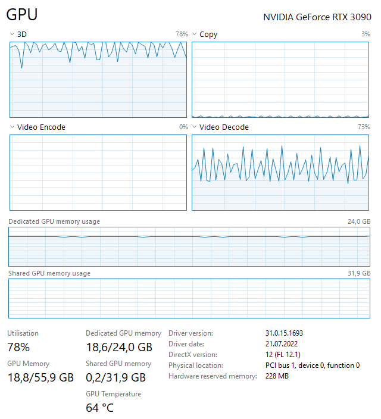

# dashcam-object-detection

This script runs YOLOv5s object detection on a folder full of MP4 files.
This can be used to filter files where some action happens, or to find videos with funny objects in them.

The whole process is done entirely on the GPU, from decoding to detecting to getting the classes out again. It does
utilize my RTX3090 pretty well with some headroom for bigger batches:

# Requirements

This runs using pytorch, so follow the [installation for pytorch first](https://pytorch.org/get-started/locally/).

Then install the remaining packages:
> pip3 install -r requirements.txt

# Usage

The script only needs an input and output folder to run:
> python3 filter_files.py -i DCIM/Normal -o DCIM/Detected/

which will, if an object is detected in any frame of a mp4, move the video to the output folder.

If you wish to ignore certain classes, you can pass `--ignore` with a comma separated list of the YOLO classnames, eg:

> python3 filter_files.py -i DCIM/Normal -o DCIM/Detected/ --ignore car,truck,skateboard

If you want to include certain classes however, you can pass `--include` with the same format:

> python3 filter_files.py -i DCIM/Normal -o DCIM/Detected/ --include car,truck,skateboard

Once an included class was found, the video will be moved without further inference.

If you have GPU support compiled into decord, you can also enable this via:
> python3 filter_files.py --decord-gpu True

by default, it will use the CPU to decode the frames, doing this whole process on the GPU as well brings additional
performance.

You can change the batch size to match your RAM/VRAM usage by supplying `--batch-size`, currently the default is 512
images at once.

